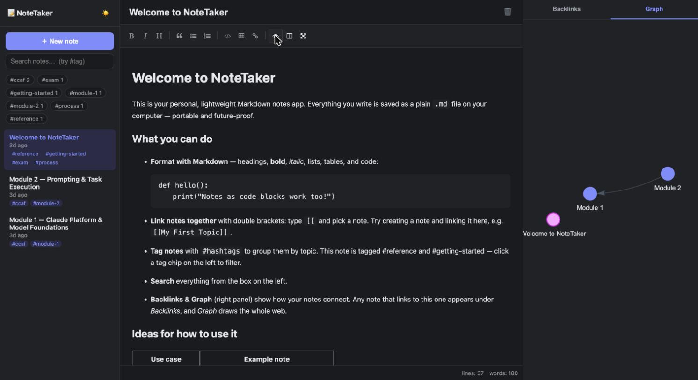

# NoteTaker

A lightweight, local Markdown notes app — like a much simpler Obsidian. Your notes
are plain `.md` files on disk, so they stay portable and future-proof.



## Features

- **Live Markdown preview** — headings, bold/italic, lists, code blocks, tables, quotes.
- **`[[Wiki-links]]`** — type `[[` to link notes, with autocomplete. Click a link to
  jump to it; linking to a note that doesn't exist yet creates it.
- **Search & `#tags`** — full-text search plus tag chips to filter by topic. Search
  `#exam` to filter by a tag directly.
- **Backlinks & Graph** — see which notes link to the current one, and a visual graph
  of how everything connects (module labels shortened, full title on hover).
- **Dark mode** — toggle with the 🌙 / ☀️ button.
- **Autosave** — edits save automatically as you type.

## Tech stack

Deliberately minimal — no build step, no framework:

- **Backend:** Node.js + Express over plain `.md` files, with an in-memory index for
  search/backlinks/graph, kept fresh by a `chokidar` file-watcher.
- **Frontend:** vanilla JS + [EasyMDE](https://github.com/Ionaru/easy-markdown-editor)
  (editor), [marked](https://github.com/markedjs/marked) (rendering, with a custom
  `[[wiki-link]]` extension) and [vis-network](https://github.com/visjs/vis-network)
  (graph) — all vendored under `public/vendor/` so it runs fully offline.

## Running it

```bash
cd notetaker
npm install       # first time only
npm start         # or: node server.js
```

Then open **http://localhost:3000** in your browser.

## Where your notes live

By default, notes are stored as `.md` files in the `notes/` folder inside this project.

To use a different folder (for example `~/Notes`), edit `config.js` or start with an
environment variable:

```bash
NOTES_DIR="~/Notes" npm start
```

You can also change the port:

```bash
PORT=4000 npm start
```

## Project structure

```
notetaker/
  server.js          # Express: static hosting + notes API + live index + file-watcher
  config.js          # notes folder + port (override via NOTES_DIR / PORT)
  public/
    index.html       # three-pane app shell (sidebar | editor | side panel)
    app.js           # frontend logic: editor, wiki-links, search, tags, backlinks, graph
    style.css        # light/dark theming
    vendor/          # EasyMDE, marked, vis-network (vendored, no build step)
  notes/             # your .md notes (personal notes are git-ignored; welcome.md is tracked)
  docs/screenshot.jpg
```

## Tips

- Press **Cmd/Ctrl + N** to create a new note.
- Rename a note by editing the title at the top — it updates the note's `# heading`.
- Because notes are just Markdown files, you can edit them in any editor; NoteTaker
  picks up external changes automatically.

---

## Project status

### Done so far

- ✅ **Core app** — Node/Express backend + vanilla-JS frontend, no build step.
- ✅ **Notes as plain `.md` files** — create, edit, autosave, delete; configurable
  notes folder; external edits picked up live via file-watcher.
- ✅ **Live Markdown preview** with full/side-by-side/fullscreen modes.
- ✅ **`[[Wiki-links]]`** — `[[` autocomplete, click-to-navigate, create-on-missing,
  and robust title-based resolution (handles titles with `&`, `—`, etc.).
- ✅ **Search & `#tags`** — full-text search with snippets, `#tag` filtering, tag chips.
- ✅ **Backlinks panel** and **graph view** (with shortened node labels + hover titles).
- ✅ **Light/dark themes**, keyboard shortcut for new note.
- ✅ **Privacy split** — personal notes stay local (git-ignored); only the app + a
  welcome seed note are committed.
- ✅ **Published to GitHub.**

### Next steps / roadmap

Rough ordering, not committed — pick what's useful:

- [ ] **Folders / sub-categories** for notes (e.g. group by course or project).
- [ ] **Note templates** (e.g. a "study module" template with pre-filled sections).
- [ ] **Export** — single note or whole vault to PDF/HTML.
- [ ] **Fullscreen / larger graph view**, and filtering the graph by tag.
- [ ] **Flashcard / self-test mode** — turn `Q:/A:` pairs into review cards.
- [ ] **Pin / favorite** important notes to the top of the sidebar.
- [ ] **Rename that also updates the filename** (today the title edits the `# heading`).
- [ ] **Basic tests** and a small `npm test` for the server API.
- [ ] **Optional:** package as a desktop app (Tauri/Electron) if a dock icon is wanted.

> Have an idea not listed here? Add it under **Next steps** and we can tackle it.
